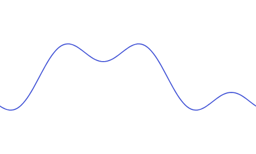
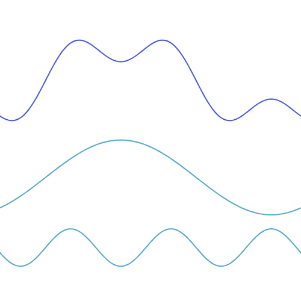
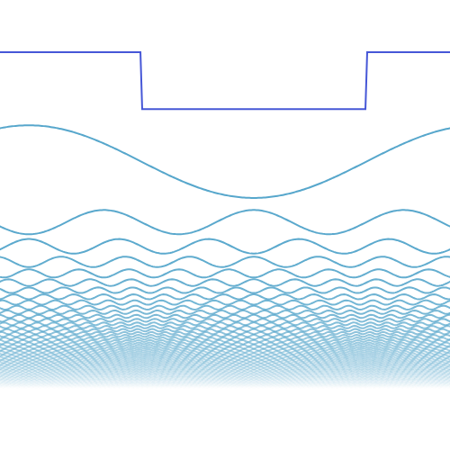

# https://mp.weixin.qq.com/s/AA-uPLvan-_ypp2v-p6M-A
# https://www.jezzamon.com/fourier/index.html

# fourier transform
## 什么是 fourier transform

简而言之，傅里叶变换把一个输入信号分解成一堆正弦波的叠加

让我们从一些简单的例子开始，然后继续前进。首先，我们来看看什么是波 —— 波随着时间的推移，一直按照某一规律变化。

eg: cos(x),sin(x) 或者一些奇怪的波

这个波可以分解为两个正弦波的叠加。也就是说，当我们将两个正弦波相加时，就会得到原来的波。

傅里叶变换可以让我们从一个复杂的波形里面，把构成这个波的单个正弦波分离出来

这次我们需要很多——理论上是无限多的正弦波来完美地表达一个方波。随着我们加入越来越多的正弦波，叠加出的波形就越来越接近方波。

正弦波加得越多，组合出的波形越接近原始波形。

使用傅里叶变换，我们可以把音频中最重要的成分表达出来，并且得到和原始声音非常接近的波形。在计算机中，波形以一系列数据点的形式来存储。
