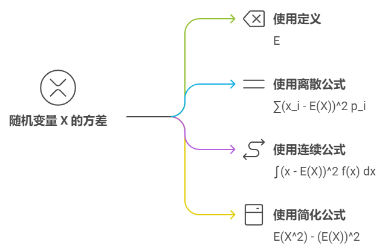

### 随机变量的期望

**定义**：  
设 $X$ 是一个离散型随机变量，其可能取的值为 $x_1, x_2, \dots, x_n$，相应的概率为 $P(X = x_i) = p_i$，则 $X$ 的期望 $E(X)$ 定义为：

$$
E(X) = \sum_{i} x_i p_i
$$

对于连续型随机变量 $X$，若其概率密度函数为 $f(x)$，则 $X$ 的期望定义为：

$$
E(X) = \int_{-\infty}^{\infty} x f(x) \, dx
$$


### 随机变量的方差

**定义**：  
随机变量 $X$ 的方差 $Var(X)$，定义为 $X$ 与其期望之差的平方的期望，即：

$$
Var(X) = E\left[(X - E(X))^2\right]
$$

对于离散型随机变量 $X$，方差可以表示为：

$$
Var(X) = \sum_{i} (x_i - E(X))^2 p_i
$$

对于连续型随机变量 $X$，其方差为：

$$
Var(X) = \int_{-\infty}^{\infty} (x - E(X))^2 f(x) \, dx
$$

**简化公式**：  
通过展开平方项，方差也可以表示为：

$$
Var(X) = E(X^2) - (E(X))^2
$$



```python
import numpy as np

# 生成一组随机变量
data = np.array([1, 2, 3, 4, 5])

# 计算期望值
expectation = np.mean(data)

# 计算方差
variance = np.var(data)

print("期望值: ", expectation)
print("方差: ", variance)
```
