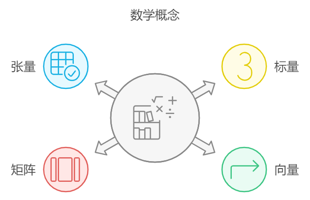

## 线性代数

### 标量（scalar）

一个标量表示一个单独的数，它不同于线性代数中研究的其他大部分对象（通常是多个数的数组）。我们用斜体表示标量。标量通常被赋予小写的变量名称。

### 向量（vector）

**向量**是一组有序的数，可以理解为一个多维空间中的点或箭头。通常我们赋予向量粗体的小写变量名称，比如
$$ \mathbf{v} = \begin{pmatrix} v_1 \\ v_2 \end{pmatrix} $$
向量中的元素可以通过带脚标的斜体表示。向量$x$的第一个元素是$x_1$，第二个元素是$x_2$。

### 矩阵（matrix）
**矩阵**是一个二维数组，可以看作是多个向量的组合。同时也是描述线性变换的一种工具。矩阵通常表示为一个 $m \times n$ 的数组，其中 $m$ 是行数，$n$ 是列数。例如，3 行 2 列的矩阵可以写作：

$$ A = \begin{pmatrix} a_{11} & a_{12} \\ a_{21} & a_{22} \\ a_{31} & a_{32} \end{pmatrix} $$

### 张量（tensor）
​在某些情况下，我们会讨论坐标超过两维的数组。一般地，一个数组中的元素分布在若干维坐标的规则网格中，我们将其称之为张量。使用 $A$ 来表示张量。张量$A$中坐标为$(i,j,k)$的元素记作$A_{(i,j,k)}$




### 线性变换

**线性变换**是将一个向量变换为另一个向量的操作，这种变换满足两个条件：
1. 加法保持：$T(\mathbf{u} + \mathbf{v}) = T(\mathbf{u}) + T(\mathbf{v})$
2. 数乘保持：$T(c \mathbf{v}) = c T(\mathbf{v})$

矩阵就是一种描述线性变换的工具。假设我们有一个矩阵 $A$ 和一个向量 $\mathbf{v}$，矩阵与向量的乘积表示了一个线性变换：

$$ \mathbf{w} = A \mathbf{v} $$

例如，假设矩阵 $A$ 是 $2 \times 2$ 的，向量 $\mathbf{v}$ 是一个二维向量：

$$ A = \begin{pmatrix} a_{11} & a_{12} \\ a_{21} & a_{22} \end{pmatrix}, \quad \mathbf{v} = \begin{pmatrix} v_1 \\ v_2 \end{pmatrix} $$

矩阵与向量的乘积是：

$$ \mathbf{w} = \begin{pmatrix} a_{11} & a_{12} \\ a_{21} & a_{22} \end{pmatrix} \begin{pmatrix} v_1 \\ v_2 \end{pmatrix} = \begin{pmatrix} a_{11} v_1 + a_{12} v_2 \\ a_{21} v_1 + a_{22} v_2 \end{pmatrix} $$


### 代码实现


```python
import torch

# 定义向量
v = torch.tensor([1.0, 2.0])

# 定义矩阵
A = torch.tensor([[1.0, 2.0], [3.0, 4.0]])

# 矩阵与向量相乘
result = torch.matmul(A, v)
print(result)

# 计算矩阵的逆
A_inv = torch.inverse(A)
print(A_inv)

# 验证矩阵乘以它的逆是否得到单位矩阵
identity = torch.matmul(A, A_inv)
print(identity)
```
