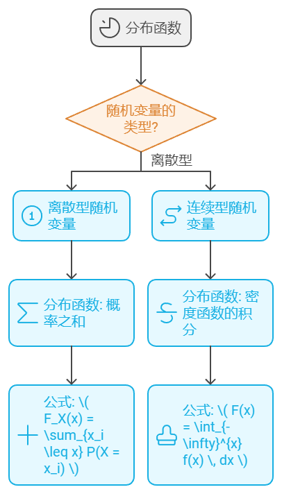

### **样本空间**（sample space）
描述随机试验所有可能结果的集合，通常记作 $S$ 或 $\Omega$。

#### 定义：
设 $S$ 是一个集合，其中的每个元素代表随机实验的一个可能结果。则称 $S$ 为该随机试验的**样本空间**，其中的每个元素 $\omega \in S$ 称为**样本点**。

样本空间可以是有限的或无限的。

**抛硬币实验**：
- 样本空间为 $S = \{正, 反\}$。

#### 数学形式：
如果我们进行一个随机试验，所有可能结果可以通过一个集合 $S$ 表示，那么我们可以定义一个概率空间 $(S, \mathcal{F}, P)$，其中：
- $S$ 是样本空间；
- $\mathcal{F}$ 是 $S$ 上的事件集合；
- $P$ 是定义在事件集合上的概率函数。


### **条件概率**（Conditional Probability）
是在已知某一事件发生的条件下，另一个事件发生的概率。假设事件 $A$ 和事件 $B$ 是两个事件，**条件概率**指的是在事件 $B$ 已经发生的条件下，事件 $A$ 发生的概率，记作 $P(A \mid B)$

$$
P(A \mid B) = \frac{P(AB)}{P(B)}
$$

其中：
- $P(A \mid B)$ 表示在事件 $B$ 已经发生的条件下，事件 $A$ 发生的概率；
- $P(AB)$ 表示事件 $A$ 和事件 $B$ 同时发生的概率；
- $P(B)$ 是事件 $B$ 发生的概率（前提条件是 $P(B) > 0$，即 $B$ 必须有发生的可能性）。
- $AB$也记作$A \cap B$

#### 性质：
1. **乘法法则**：由条件概率公式可以推导出：
   $$ P(AB) = P(A \mid B) \cdot P(B) $$

2. **全概率公式**：如果事件 $B_1, B_2, \dots, B_n$ 是一个划分（即它们两两互斥且联合起来覆盖整个样本空间），则对于任何事件 $A$：
   $$ P(A) = \sum_{i=1}^{n} P(A \mid B_i) \cdot P(B_i) $$

3. **贝叶斯定理**：通过条件概率可以推导出贝叶斯定理：
   $$ P(A \mid B) = \frac{P(B \mid A) \cdot P(A)}{P(B)} $$


### **随机变量**（Random Variable）


是定义在样本空间上的一个函数，它将每个实验结果映射到实数或更广泛的值域中。形式上，我们可以将随机变量 $X$ 定义为：

$$
X: \Omega \to \mathbb{R}
$$

其中：
- $\Omega$ 是样本空间，即所有可能实验结果的集合。
- $\mathbb{R}$ 表示实数集，随机变量 $X$ 将每个实验结果映射为一个实数。

#### 随机变量的分类
1. **离散型随机变量**：随机变量只能取有限个或可数多个值。例如，掷骰子的结果就是一个离散型随机变量。
2. **连续型随机变量**：随机变量可以取某一区间内的所有实数值。例如，测量某个物体的长度可能就是一个连续型随机变量。


### **分布函数**（Distribution Function）
是描述随机变量取值范围内的概率累积情况的一个重要函数。分布函数能够全面反映随机变量的概率分布特征。



---

设随机变量 $X$ 定义在样本空间 $\Omega$ 上，其**分布函数** $F_X(x)$ 定义为：

$$
F_X(x) = P(X \leq x)
$$

即，分布函数 $F_X(x)$ 是随机变量 $X$ 取值小于或等于某个实数 $x$ 的概率。


#### 离散型随机变量的分布函数

如果随机变量 $X$ 是离散型的，它只取有限或可数多个值 $\{x_1, x_2, \dots\}$，那么其分布函数可以写成以下形式：

$$
F_X(x) = \sum_{x_i \leq x} P(X = x_i)
$$

即 $F_X(x)$ 是所有小于或等于 $x$ 的离散值的概率之和。

#### 连续型随机变量的分布函数

概率密度函数:

设随机变量 $X$ 分布函数 $F(x)$ 存在 $f(x)$ 对于任意实数 $x$ 有：


   $$
  F(x) = \int_{-\infty}^{x} f(x) \, dx 
   $$

则称$X$为连续性随机变量,$f(x)$为$X$的概率密度函数,简称概率密度函数

---

#### 常见分布代码实现

```python
import numpy as np
import matplotlib.pyplot as plt
from scipy.stats import norm, poisson, binom

# 二项分布
n, p = 10, 0.5
k = np.arange(0, n+1)
plt.plot(k, binom.pmf(k, n, p), label='二项分布', marker='o')
plt.legend()
plt.show()

# 泊松分布
lambda_ = 5
k = np.arange(0, 15)
plt.plot(k, poisson.pmf(k, lambda_), label='泊松分布', marker='o')
plt.legend()
plt.show()

# 正态分布
# 生成10000个服从标准正态分布的随机变量
data = np.random.normal(0, 1, 10000)
# 绘制直方图
plt.hist(data, bins=50, density=True, alpha=0.6, color='g')
# 绘制标准正态分布的概率密度函数
mu, sigma = 0, 1  # 均值和标准差
x = np.linspace(-4, 4, 100)
pdf = 1/(np.sqrt(2 * np.pi * sigma**2)) * np.exp(- (x - mu)**2 / (2 * sigma**2))
plt.plot(x, pdf, linewidth=2, color='r')
plt.title('Normal Distribution')
plt.show()
```


