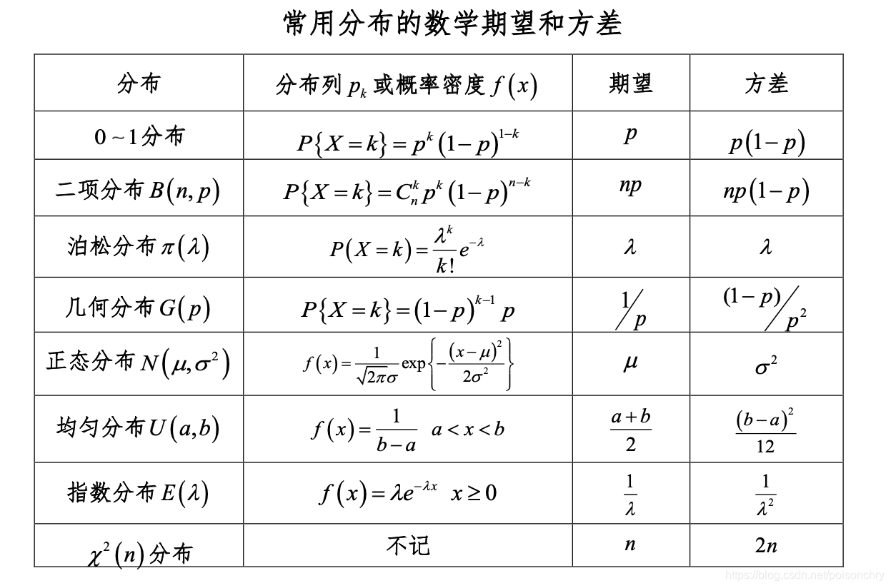

### 1. 概率分布

**概率分布**是随机变量可能取的值及其对应概率的描述。每个随机变量都有其对应的概率分布，用来表示该变量的值是如何分布在不同可能性上的。概率分布可以分为**离散概率分布**和**连续概率分布**两大类。

#### 1.1 离散概率分布
离散概率分布适用于随机变量可以取有限或可数的值的情况。例如：
- **二项分布**：描述了重复 n 次独立伯努利试验的成功次数的分布。
- **泊松分布**：适用于描述在固定时间内某个事件发生的次数。

其概率质量函数 (PMF) 定义了随机变量取每个可能值的概率。

#### 1.2 连续概率分布
连续概率分布用于描述随机变量可以取任意实数值的情况。例如：
- **正态分布（高斯分布-Normal Distribution~$ N(0,1^2) $）**：广泛用于许多自然现象的建模，如人的身高、体重等。
- **均匀分布**：表示每个值在区间上出现的概率相等。

其概率密度函数 (PDF) 描述了随机变量在某一区间内取值的概率。

### 2. 随机变量

**随机变量**是定义在样本空间上的函数，它将样本映射到实数。随机变量分为两种类型：
- **离散随机变量**：取值为有限或可数的，例如投掷硬币的结果（正面或反面）。
- **连续随机变量**：取值为连续区间中的任意实数，例如温度、时间等。

随机变量通过概率分布来描述其可能的值和对应的概率。

### 3. 常见问题及解答

**问题1**: 为什么正态分布如此常见？
**解答**: 根据**中心极限定理**，大量独立随机变量的和趋于正态分布，因此许多自然现象和统计测量都近似呈现正态分布。

**问题2**: 随机变量与概率分布的区别是什么？
**解答**: 随机变量是一个函数，它赋予事件一个数值，而概率分布则描述了该随机变量可能取的值及其概率。

### 4. 代码实现示例

使用 Python 的 `numpy` 和 `matplotlib` 库可以生成和可视化正态分布的随机数据。

```python
import numpy as np
import matplotlib.pyplot as plt

# 生成10000个服从标准正态分布的随机变量
data = np.random.normal(0, 1, 10000)

# 绘制直方图
plt.hist(data, bins=50, density=True, alpha=0.6, color='g')

# 绘制标准正态分布的概率密度函数
mu, sigma = 0, 1  # 均值和标准差
x = np.linspace(-4, 4, 100)
pdf = 1/(np.sqrt(2 * np.pi * sigma**2)) * np.exp(- (x - mu)**2 / (2 * sigma**2))
plt.plot(x, pdf, linewidth=2, color='r')
plt.title('Normal Distribution')
plt.show()
```

### 常见的概率分布
1. **均匀分布**：在某个区间内所有值的概率相等。离散均匀分布的概率密度函数是：
   $$
   P(X=x) = \frac{1}{b-a+1}, \quad x \in \{a, a+1, ..., b\}
   $$
   连续均匀分布的概率密度函数是：
   $$
   f(x) = \frac{1}{b-a}, \quad x \in [a, b]
   $$

2. **正态分布（高斯分布）**：常见于许多自然现象，其概率密度函数为：
   $$
   f(x|\mu, \sigma^2) = \frac{1}{\sqrt{2\pi\sigma^2}} \exp\left(-\frac{(x-\mu)^2}{2\sigma^2}\right)
   $$
   其中，$\mu$为均值，$\sigma^2$为方差。

3. **二项分布**：表示n次独立实验中成功k次的概率：
   $$
   P(X=k) = \binom{n}{k} p^k (1-p)^{n-k}
   $$

4. **泊松分布**：表示单位时间内发生某事件k次的概率，常用于描述稀有事件：
   $$
   P(X=k) = \frac{\lambda^k e^{-\lambda}}{k!}
   $$


## 3. 代码实现（以Python为例）

```python
import numpy as np
import matplotlib.pyplot as plt
from scipy.stats import norm, poisson, binom


# 二项分布
n, p = 10, 0.5
k = np.arange(0, n+1)
plt.plot(k, binom.pmf(k, n, p), label='二项分布', marker='o')
plt.legend()
plt.show()

# 泊松分布
lambda_ = 5
k = np.arange(0, 15)
plt.plot(k, poisson.pmf(k, lambda_), label='泊松分布', marker='o')
plt.legend()
plt.show()
```




