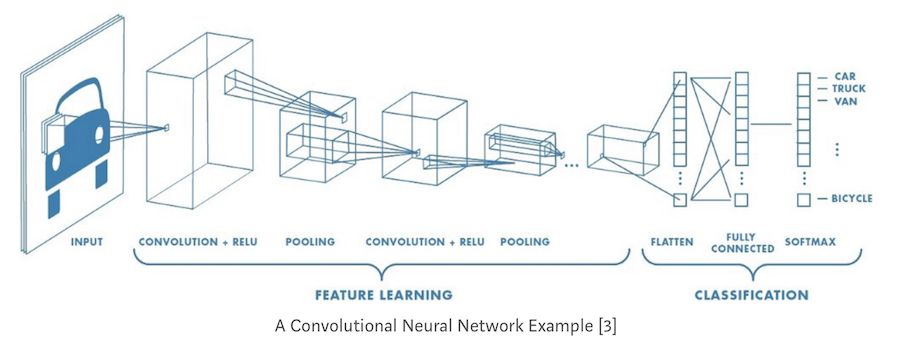
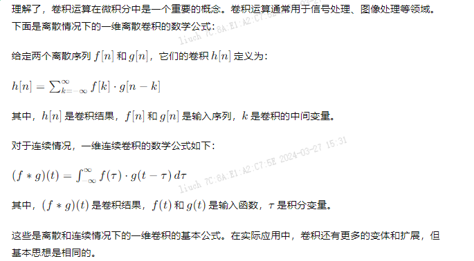
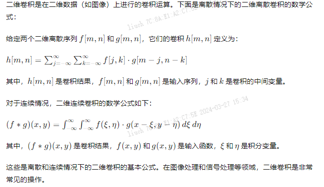
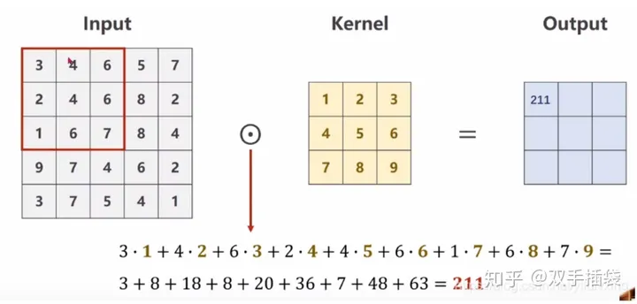
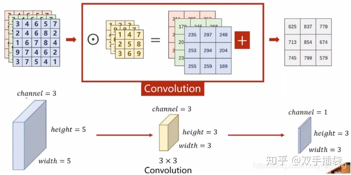
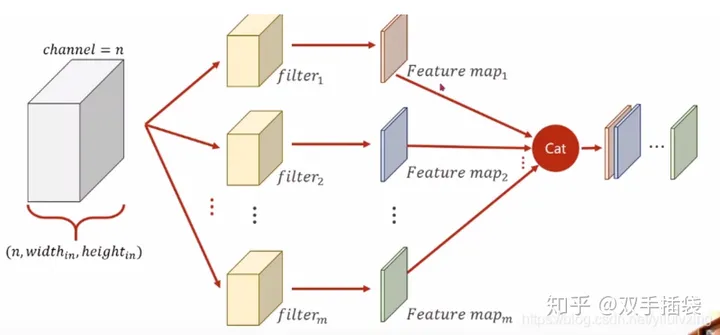
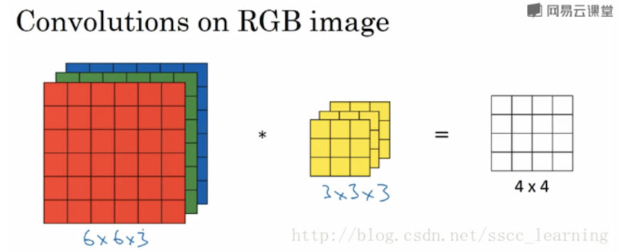
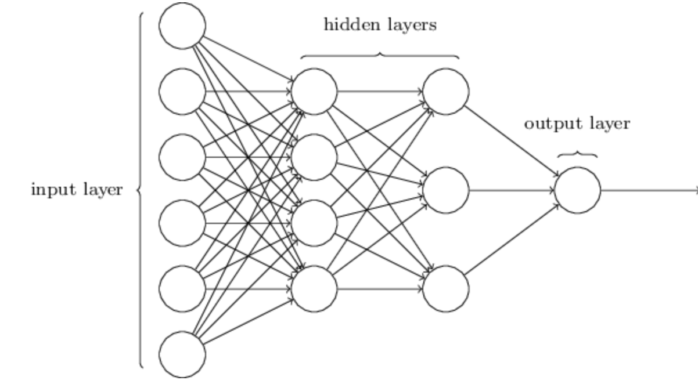

## 卷积神经网络(Convolutional Neural Networks, CNN)

### What

```text
卷积是微积分里的一个术语，指卷积运算

CNN网络结构一般包含卷积层、池化层、全连接层、激活函数、反向传播。

最常见的CNN网络结构如下：
INPUT -> [CONV -> RELU]*N -> [POOL?]*M -> [FC -> RELU]*K -> FC

关键字
输入通道 输出通道 卷积核
池化 全连接层 激活函数

卷积操作通常涉及到以下参数：
W：输入数据的空间尺寸（宽度或高度）。
F：卷积核（也称为滤波器）的空间尺寸。
P：填充（padding）的大小，即在输入数据周围添加的额外行和列。
S：步长（stride），即卷积核在输入数据上移动的步长。
output = (W - F + 2P) / S + 1

总结
1：输入通道个数(如果是图片,那么rgb的,一般包含三个通道) 等于 卷积核通道个数(由输入矩阵的通道数所决定)
2：卷积核个数 等于 输出通道个数(一个卷积核其实就是一个filer)
最后训练的其实就是卷积核
```




```python
import torch.nn as nn
import torch.nn.functional as F

class ConvolutionalNeuralNetwork(nn.Module):
    def __init__(self):
        super(ConvolutionalNeuralNetwork, self).__init__()
        # 定义第一个卷积层
        # 输入通道数为1，输出通道数为6，卷积核大小为5x5
        self.conv1 = nn.Conv2d(1, 6, 5)
        # 定义第二个卷积层
        # 输入通道数为6，输出通道数为16，卷积核大小为5x5
        self.conv2 = nn.Conv2d(6, 16, 5)
        # 定义第一个池化层
        # 使用2x2的窗口进行最大池化
        self.pool = nn.MaxPool2d(2, 2)
        # 定义第一个全连接层
        # 输入特征数为16*5*5，输出特征数为120
        self.fc1 = nn.Linear(16 * 5 * 5, 120)
        # 定义第二个全连接层
        # 输入特征数为120，输出特征数为84
        self.fc2 = nn.Linear(120, 84)
        # 定义输出层
        # 输入特征数为84，输出特征数为10（假设有10个类别）
        self.fc3 = nn.Linear(84, 10)

    def forward(self, x):
        # 第一层卷积 + ReLU + 池化
        x = self.pool(F.relu(self.conv1(x)))
        # 第二层卷积 + ReLU + 池化
        x = self.pool(F.relu(self.conv2(x)))
        # 将多维张量展平为一维
        x = x.view(-1, 16 * 5 * 5)
        # 第一个全连接层 + ReLU
        x = F.relu(self.fc1(x))
        # 第二个全连接层 + ReLU
        x = F.relu(self.fc2(x))
        # 输出层
        x = self.fc3(x)
        return x
```

### How





1：单通道卷积

```text
以单通道卷积为例，输入为（1,5,5），分别表示1个通道，宽为5，高为5。
假设卷积核大小为3x3，padding=0，stride=1。
卷积过程如下1：
相应的卷积核不断的在图像上进行遍历，最后得到3x3的卷积结果，结果如下2：
```




2.多通道卷积1

```text
以彩色图像为例，包含三个通道，分别表示RGB三原色的像素值，输入为（3,5,5），
分别表示3个通道，每个通道的宽为5，高为5。
假设卷积核只有1个，卷积核通道为3，每个通道的卷积核大小仍为3x3，padding=0，stride=1。

卷积过程如下，每一个通道的像素值与对应的卷积核通道的数值进行卷积，
因此每一个通道会对应一个输出卷积结果，三个卷积结果对应位置累加求和，
得到最终的卷积结果（这里卷积输出结果通道只有1个，因为卷积核只有1个）

可以这么理解：最终得到的卷积结果是原始图像各个通道上的综合信息结果。
```


```text
上述过程中，每一个卷积核的通道数量，必须要求与输入通道数量一致，
因为要对每一个通道的像素值要进行卷积运算，所以每一个卷积核的通道数量必须要与输入通道数量保持一致

我们把上述图像通道如果放在一块，计算原理过程还是与上面一样，堆叠后的表示如下：
```



3.多通道卷积2

```text
在上面的多通道卷积1中，输出的卷积结果只有1个通道，把整个卷积的整个过程抽象表示，过程如下：
```


```text
即：由于只有一个卷积核，因此卷积后只输出单通道的卷积结果
（黄色的块状部分表示一个卷积核，黄色块状是由三个通道堆叠在一起表示的，每一个黄色通道与输入卷积通道分别进行卷积，
也就是channel数量要保持一致，图片组这里只是堆叠放在一起表示而已）。

那么，如果要卷积后也输出多通道，增加卷积核（filers）的数量即可，示意图如下：
注:下面的feature map的颜色，只是为了表示不同的卷积核对应的输出通道结果，不是表示对应的输出颜色
```



```python
# 代码实现
import torch

in_channels = 5  # 输入通道数量
out_channels = 10  # 输出通道数量
width = 100  # 每个输入通道上的卷积尺寸的宽
heigth = 100  # 每个输入通道上的卷积尺寸的高
kernel_size = 3  # 每个输入通道上的卷积尺寸
batch_size = 1  # 批数量

input = torch.randn(batch_size, in_channels, width, heigth)
conv_layer = torch.nn.Conv2d(in_channels, out_channels, kernel_size=kernel_size)

out_put = conv_layer(input)

print(input.shape)
print(out_put.shape)
print(conv_layer.weight.shape)
```


### 卷积层(Convolutional Layer)

```text
CNN网络在前向传播的时候，让每个滤波器(卷积核)都在输入数据的宽度和高度上滑动（更精确地说是卷积），
然后计算整个滤波器和输入数据任一处的内积。当滤波器沿着输入数据的宽度和高度滑过后，滤波器与滑动窗口进行点乘，
点乘结果经过激活函数(常用Relu)之后，会生成一个2维的激活图（activation map），激活图给出了在每个空间位置处滤波器的反应。
网络会让滤波器学习到当它看到某些类型的视觉特征时就激活，具体的视觉特征可能是某些方位上的边界，或者在第一层上某些颜色的斑点，
甚至可以是网络更高层上的蜂巢状或者车轮状图案。
卷积核直观上可以理解为具有学习功能的特征提取工具，提取目标物体的突出特征。

一般输入图像表示为(w x h x c)的矩阵，w和h表示输入图像的宽和高，c表示输入图像维度，
如果是灰度图像，则c=1，如果是RGB图像，则c=3。
在CNN网络里，输入图像一般有两种处理方式，一种是全转换为RGB图像，
如果是灰度图像，则将二维矩阵(w x h)复制3次，变成(w x h x 3)；
另一种是全转换为二维的灰度图像，像素值在0～255之间。
```

1. 卷积层参数

```text
1.步长(stride):
卷积核(滤波器)在输入数据上进行滑动时的间隔像素。如果滤波器的步长大于1，会使输出数据的尺寸小于输入数据
2.零填充（zero-padding）:
用0填充输入数据的边缘，0填充可以使输出数据和输入数据尺寸相同
3.感受野（receptive field）:
卷积核的空间尺寸，一般为3x3，5x5，7x7；感受野的尺寸(宽和高)是超参数，由用户自己定义，但是深度必须和输入数据的深度相等

注意：我们对待空间维度（宽和高）与深度维度是不同的：连接在空间（宽高）上是局部的，但是在深度上总是和输入数据的深度一致。
例1：假设输入数据体尺寸为[32x32x3]（比如CIFAR-10的RGB图像），如果感受野（或滤波器尺寸）是5x5，
那么卷积层中的每个神经元会有输入数据体中[5x5x3]区域的权重，共5x5x3=75个权重（还要加一个偏差参数）。
注意这个连接在深度维度上的大小必须为3，和输入数据体的深度一致。
例2：假设输入数据体的尺寸是[16x16x20]，感受野尺寸是3x3，那么卷积层中每个神经元和输入数据体就有3x3x20=180个连接。
再次提示：在空间上连接是局部的（3x3），但是在深度上是和输入数据体一致的（20）

4.输出通道数(channel):
通道(channel)对输入数据是指数据的深度，
比如RBG图像，channel是3；对输出数据是指卷积核的数量(不是深度，卷积核的深度与输入数据的深度保持一致)，
如下图，有 6×6×3 的图片样本，使用 3x3 尺寸的卷积核（filter）进行卷积操作，那么输入图片的 channels 为 3，
而卷积核的深度为3(与输入图片的深度保持一致)，所以卷积核是 3x3x3，如果只有1个卷积核，步长为1，不进行零填充。
那么每一层卷积核中的27个数字与分别与每一层样本对应相乘后得到一个和，一共有3层，对这3层的卷积结果再进行求和，得到第一个结果。
依次进行，最终得到 4×4的结果。如果卷积核个数为2，即 2x 3x3x3，那么结果为 2x4x4。
```




2. 卷积层的计算细节

如图，输入图像IN是RGB图像，kernel大小是3x3x3，kernel数量(输出通道数)为5


输入矩阵格式：四个维度，依次为：样本数、图像通道数、图像高度、图像宽度

输出矩阵格式：与输出矩阵的维度顺序和含义相同，但是后三个维度（图像高度、图像宽度、图像通道数）的尺寸发生变化。

权重矩阵（卷积核）格式：同样是四个维度，但维度的含义与上面两者都不同，为：卷积核高度、卷积核宽度、输入通道数、输出通道数（卷积核个数）

输入矩阵、权重矩阵、输出矩阵这三者之间的相互决定关系

卷积核的输入通道数（in depth）由输入矩阵的通道数所决定。（红色标注）

输出矩阵的通道数（out depth）由卷积核的输出通道数所决定。（绿色标注）

输出矩阵的高度和宽度（height, width）这两个维度的尺寸由输入矩阵、卷积核、扫描方式所共同决定。

下图输入图像是RGB图像，大小是 7x7x3 (用0填充了一圈)，卷积核大小 3x3x3，用了2个卷积核，步长为2，输出结果为 3x3x2，
下图在绿色的输出激活数据上循环演示，展示了其中每个元素都是先通过蓝色的输入数据和红色的滤波器逐元素相乘，然后求其总和，最后加上偏差得来。


3. 卷积层特点

```text
1.大量的计算，网络的主要计算都产生在卷积层。
2.具有平移不变性，对待检测物体进行平移，不影响检测效果
3.参数共享，控制参数的数量。
4.卷积操作通常后面接的是ReLU层，对激活图中的每个元素做激活函数运算。
```

### 池化层(Pooling Layer)

```text
通常每个卷积层之后会紧跟Relu，激活需要学习的特征，连续的卷积层(包含Relu)之后，会插入一个池化层，
池化层的作用是降维，主要是降低输出数据的空间尺寸(不改变深度)，这样也能减少网络的参数量，也能有效控制过拟合。

比如说图像中的相邻像素倾向于具有相似的值，因此通常卷积层相邻的输出像素也具有相似的值。
这意味着，卷积层输出中包含的大部分信息都是冗余的。
如果我们使用边缘检测滤波器并在某个位置找到强边缘，那么我们也可能会在距离这个像素1个偏移的位置找到相对较强的边缘。
但是它们都一样是边缘，我们并没有找到任何新东西。池化层解决了这个问题。
这个网络层所做的就是通过减小输入的大小降低输出值的数量。池化一般通过简单的最大值、最小值或平均值操作完成。

不使用池化层：池化层不是必须的，目前有一些方法可以替代池化层，比如卷积层中使用更大的步长来降低数据体的尺寸。
```


### 全连接层(Fully-Connected Layer)



```text
全连接层的作用是将卷积提取的特征映射到每一类，方便损失函数打分。
全连接层的输入是前一层的所有神经元个数，输出是用户自定义，
fc = nn.Linear(in_features=input_size, out_features=50)
一般最后一层全连接层的输出个数是需要检测物体的类别数(对于分类网络)。

全连接层与卷积层的区别?
1.卷积层的输入是输入矩阵的一块区域，全连接层的输入必须是一个列向量；
2.卷积层是局部连接，全连接网络使用了图像的全局信息；
全连接层和卷积层的相同点都是神经元进行点积运算。

卷积层代替全连接层的好处?
如果网络使用了全连接层，那么输入数据的尺寸一般是固定(因为全连接层的权重矩阵是固定的，
所以最后输入全连接层的feature map的尺寸也是固定的)。但是如果用卷积层代替全连接层，
就可以输入任意尺寸的数据了。
```

经典CNN模型

```text
LeNet-5,AlexNet,VGG-16,ResNet,GoogLeNet
```

### Reference(参考文档)

* [卷积理解一](https://buyi1128.github.io/2019/02/26/basicCNN/)
* [卷积理解二](https://buyi1128.github.io/2019/03/06/activate/)
* [常用数据结构和算法系列(一)](https://buyi1128.github.io/2019/03/04/basic-algorithm/)
* [常用数据结构和算法系列(二)](https://buyi1128.github.io/2019/04/23/%E6%9C%BA%E5%99%A8%E5%AD%A6%E4%B9%A0%E5%9F%BA%E6%9C%AC%E7%AE%97%E6%B3%95/)
* [leetcode-github库](https://github.com/aceliuchanghong/myLeetCode)
* [CNN基础及经典模型介绍](https://zhuanlan.zhihu.com/p/344562609)
* [CNN卷积核与通道讲解](https://zhuanlan.zhihu.com/p/251068800)
