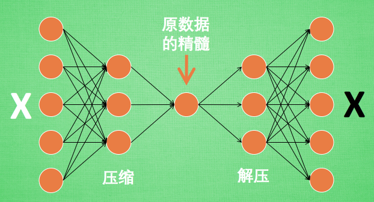

## AE **自动编码器(Autoencoder)** 
是一种神经网络模型，常用于无监督学习的降维、数据压缩以及特征学习。它的目标是将输入数据压缩成低维的表示（编码），再从这个低维表示重构出原始数据。



### 核心概念
自动编码器主要由两个部分组成：
1. **编码器（Encoder）**：将高维的输入数据映射到低维的潜在空间（编码）。
2. **解码器（Decoder）**：从低维的潜在空间重构出原始的输入数据。

模型的结构可以表示为：
- 编码器：$ \mathbf{z} = f(\mathbf{x}) $，将输入 $ \mathbf{x} $ 映射到潜在空间的编码 $ \mathbf{z} $。
- 解码器：$ \mathbf{x'} = g(\mathbf{z}) $，将编码 $ \mathbf{z} $ 解码回输入空间，得到重构的输入 $ \mathbf{x'} $。

损失函数通常采用重构误差（比如均方误差）来衡量原始输入 $ \mathbf{x} $ 与重构输入 $ \mathbf{x'} $ 的差异：
$$
L(\mathbf{x}, \mathbf{x'}) = ||\mathbf{x} - \mathbf{x'}||^2
$$

### 常见问题及解答
1. **自动编码器与PCA的区别？**
   PCA是线性降维方法，而自动编码器可以学习非线性映射，因此能够更好地处理复杂的非线性数据。

2. **编码器输出的潜在表示如何解释？**
   自动编码器的潜在表示（编码）是数据的一种压缩形式，保留了输入数据的核心特征信息，通常维度远小于原始数据。

3. **自动编码器能生成新数据吗？**
   标准的自动编码器不能生成新数据，但其扩展变体——**变分自动编码器（VAE）**——可以通过在潜在空间采样生成新数据。

4. **如何避免自动编码器过拟合？**
   可以引入正则化技术（如L2正则化或稀疏性约束），或使用噪声自动编码器（Denoising Autoencoder）和变分自动编码器来增强模型的泛化能力。

### 代码实现
以下是一个简单的自动编码器实现，使用`PyTorch`构建并训练一个用于MNIST手写数字数据集的自动编码器：

```python
import torch
import torch.nn as nn
import torch.optim as optim
from torchvision import datasets, transforms

# 定义自动编码器模型
class Autoencoder(nn.Module):
    def __init__(self):
        super(Autoencoder, self).__init__()
        # 编码器
        self.encoder = nn.Sequential(
            nn.Linear(28 * 28, 128),
            nn.ReLU(),
            nn.Linear(128, 64),
            nn.ReLU(),
            nn.Linear(64, 32)
        )
        # 解码器
        self.decoder = nn.Sequential(
            nn.Linear(32, 64),
            nn.ReLU(),
            nn.Linear(64, 128),
            nn.ReLU(),
            nn.Linear(128, 28 * 28),
            nn.Sigmoid()
        )
    
    def forward(self, x):
        x = self.encoder(x)
        x = self.decoder(x)
        return x

# 加载MNIST数据集
transform = transforms.Compose([transforms.ToTensor(), transforms.Normalize((0.5,), (0.5,))])
train_data = datasets.MNIST(root='./data', train=True, download=True, transform=transform)
train_loader = torch.utils.data.DataLoader(train_data, batch_size=64, shuffle=True)

# 实例化模型、损失函数和优化器
autoencoder = Autoencoder()
criterion = nn.MSELoss()
optimizer = optim.Adam(autoencoder.parameters(), lr=0.001)

# 训练模型
for epoch in range(5):
    for data, _ in train_loader:
        data = data.view(-1, 28 * 28)  # 将图像数据展平成向量
        optimizer.zero_grad()
        outputs = autoencoder(data)
        loss = criterion(outputs, data)
        loss.backward()
        optimizer.step()
    print(f'Epoch {epoch+1}, Loss: {loss.item()}')
```

### 数学公式的推导与理解
自动编码器的目标是最小化重构误差。损失函数通常是输入 $ \mathbf{x} $ 和重构数据 $ \mathbf{x'} $ 之间的距离：
$$
L(\mathbf{x}, \mathbf{x'}) = ||\mathbf{x} - \mathbf{x'}||^2
$$
其中：
- 编码器映射为 $ f(\mathbf{x}) = \mathbf{z} $，$ \mathbf{z} $ 是潜在空间中的低维表示。
- 解码器映射为 $ g(\mathbf{z}) = \mathbf{x'} $，$ \mathbf{x'} $ 是重构的数据。

通过最小化这个重构误差，网络可以学习如何在潜在空间中压缩和重建输入数据。

### 总结
自动编码器是一种强大的无监督学习模型，能够从高维数据中学习有意义的低维表示。它可以用于数据降维、去噪和特征学习，并且通过非线性映射，可以处理复杂的非线性数据。