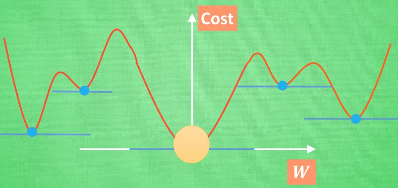

## 梯度下降 (Gradient Descent)

梯度下降是一种常用的优化算法，主要用于寻找函数的最小值或最大值。在机器学习中，它通常用于通过不断调整模型参数来最小化损失函数，从而优化模型性能。



### 核心概念
梯度下降的基本思想是沿着损失函数的负梯度方向更新参数。通过反复计算梯度并更新参数，最终可以找到损失函数的局部或全局最小值。

- **梯度**：函数的梯度是对参数的偏导数，表示函数值变化的方向和速度。
- **学习率** ($\alpha$)：学习率控制参数更新的步长，值过大会导致不稳定，值过小则会使收敛变慢。


### 常见问题及解答
1. **如何选择合适的学习率？**
   学习率过大可能导致跳过最优解，学习率过小则收敛过慢。可以使用动态学习率调整方法，如学习率衰减。

2. **如何避免陷入局部最小值？**
   使用动量梯度下降或Adam优化算法可以有效避免局部最小值，并提高收敛速度。

### 代码实现
使用Python和PyTorch实现一个简单的梯度下降过程：

```python
import torch

# 定义一个简单的目标函数： f(x) = x^2
def f(x):
    return x**2

# 定义参数x，并启用梯度
x = torch.tensor([10.0], requires_grad=True)

# 学习率
lr = 0.1

# 梯度下降迭代
for i in range(100):
    # 前向传播
    loss = f(x)
    
    # 反向传播，计算梯度
    loss.backward()
    
    # 更新参数 x = x - lr * grad
    with torch.no_grad():
        x -= lr * x.grad
    
    # 清除梯度
    x.grad.zero_()

    print(f"Iteration {i+1}: x = {x.item()}, loss = {loss.item()}")
```

### 数学公式推导
假设我们有一个目标函数 $f(\theta) = \theta^2$，其梯度为 $\nabla f(\theta) = 2\theta$。

在梯度下降中，参数 $\theta$ 的更新规则为：
$$
\theta = \theta - \alpha \nabla f(\theta)
$$
其中，$\alpha$ 是学习率，$\nabla f(\theta)$ 是梯度。

每次迭代，我们会根据这个公式不断更新参数，直到找到函数的最小值。
