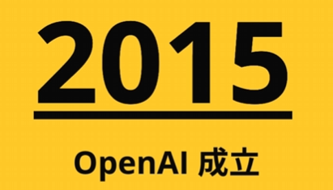
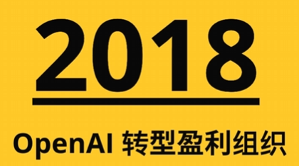
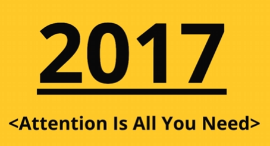

# GPT发展简史

## 起源与创立
- OpenAI成立于2015年
- 由伊隆·马斯克等人共同发起
- 最初为非营利组织

## 重要转折点
- 2018年转型为盈利性组织
- 伊隆·马斯克退出董事会

## 技术突破
- 2017年《Attention is All You Need》论文提出Transformer架构
- OpenAI的伊利亚将Transformer应用于语言模型
- 开发出ChatGPT

## 发展历程
- 2019-2023年：持续更新模型
- 2022年：GPT-3.5发布，引发AI热潮
- 2023年：发布SORA大视频模型，引发AGI讨论

## 技术核心
`Transformer`核心:
1. 文字数字化
2. 位置向量化
3. 语义关系化
4. 预测概率化
