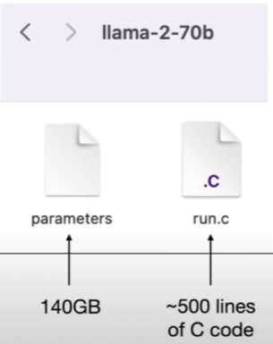

# 大语言模型的基本概念和运作原理

## 1. 大语言模型定义
大语言模型是基于海量数据训练的机器学习模型，通过学习文字之间的关联关系来生成输出。

## 2. 模型文件结构
- 大语言模型本质上是一个巨大的二进制文件
- 包含了大量的参数



## 3. 模型获取过程
1. 在数据中心使用GPU进行训练
2. 对训练结果进行过滤
3. 最终生成模型文件

## 4. 模型推理过程
- 模型接收输入的提示词
- 返回一个概率值
- 选择概率最高的词汇作为输出

```
“我喜欢吃芒果”是一个模型学习了多次的非常常见的句子,
“我喜欢吃香蕉”也是一个常见的句子，但比上面的句子要少见。
所以在模型训练过程中:
记录“芒果”在“我喜欢吃”之后出现的概率为:0.375
记录“香蕉”在“我喜欢吃”之后出现的概率为:0.146
…其他词语的出现概率..
因此，这些概率被以概率集的形式被存在参数模型文件中。(在机器学习领域，概率通常被称为权重)
```

## 5. 模型架构
- 采用Transformer架构
- 2017年由谷歌大脑团队提出
- 最初用于语言翻译
- 后被OpenAI团队用于文字预测
- 开发了GPT系列模型
