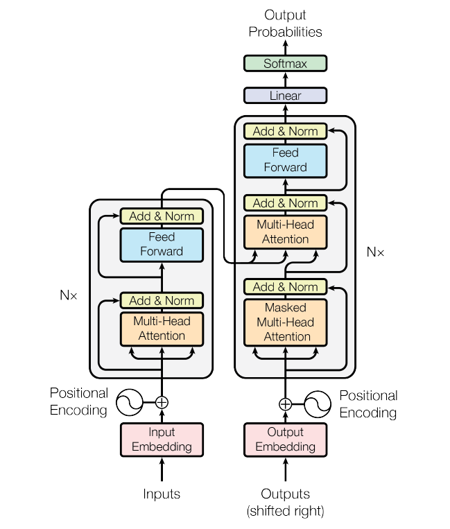

# 大语言模型的训练原理

## 1. 预训练阶段
- 模型通过大规模文本数据进行预训练
- 学习单词和短语的概率分布
- 形成文档完善器（Document Completer）

## 2. 微调与强化学习
- 通过监督微调（Supervised Fine-tuning）使模型适应特定任务
- 使用基于人类反馈的强化学习（RLHF）优化模型表现
- 将文档完善器转化为问答生成器

## 3. 核心架构
- 基于Transformer架构
- 包含编码器（Encoder）和解码器（Decoder）
- 通过学习输入和输出之间的关系生成最终结果

## 4. 指令编程与提示词工程
- 通过精心设计的指令引导模型
- 使用提示词工程（Prompt Engineering）优化输出
- 提高回答的准确性和完整性

## 5. 强化学习优化
- 使用奖励模型（Reward Model）评估输出质量
- 通过强化学习不断迭代优化
- 使模型输出更符合人类期望