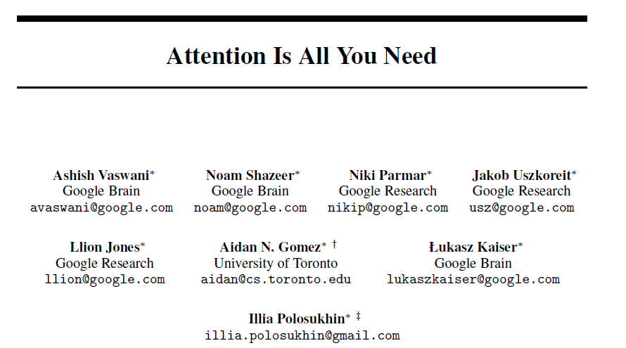
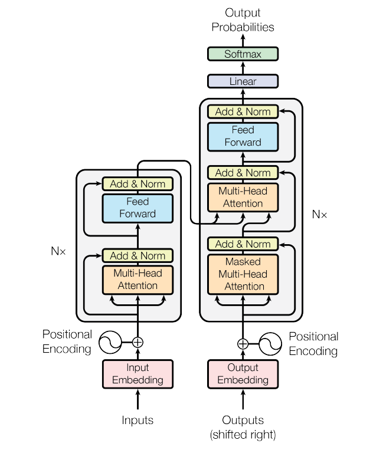
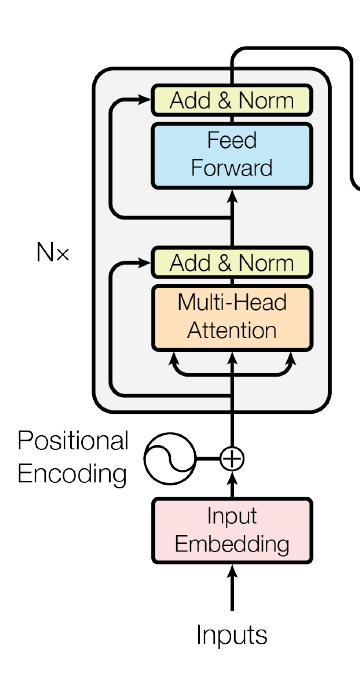
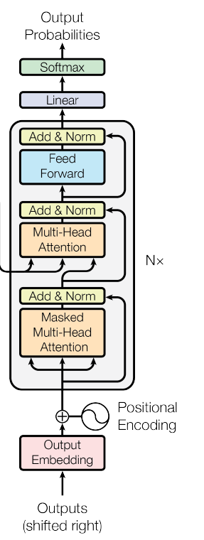
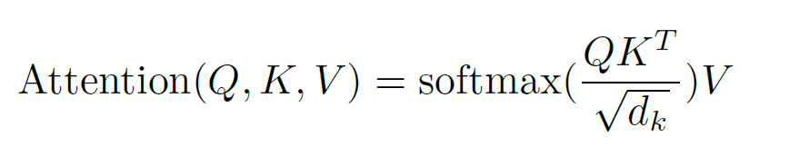
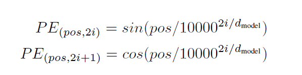

# Transformer模型介绍

## 1. 基本概念与起源
Transformer模型最初由Google Brain团队在2017年的论文《Attention is All You Need》中提出。

该模型最初应用于机器翻译任务，其创新性地完全基于注意力机制，摒弃了传统的RNN和CNN结构。

## 2. 模型架构

Transformer模型主要由两个核心部分组成：

### 2.1 编码器（Encoder）
- 由多个相同的层堆叠而成 (N = 6)
- 每层包含两个主要子层：
  - 多头自注意力机制（Multi-Head Self-Attention）
  - 前馈神经网络（Feed Forward Neural Network）
- 每个子层都采用残差连接和层归一化

### 2.2 解码器（Decoder）
- 同样由多个相同的层堆叠 (N = 6)
- 每层包含三个主要子层：
  - 掩码多头自注意力机制（Masked Multi-Head Self-Attention）
  - 编码器-解码器注意力机制（Encoder-Decoder Attention）
  - 前馈神经网络（Feed Forward Neural Network）
- 同样采用残差连接和层归一化

### 2.3 残差连接和层归一化（Add & Norm）
- 公式为:LayerNorm(x + Sublayer(x)) 其中
  - 残差链接: x + Sublayer(x)
  - 层归一化: LayerNorm
  
## 3. 核心机制

### 3.1 注意力机制
- 通过计算Query、Key和Value之间的关系来分配注意力权重
- 公式：Attention(Q,K,V) = softmax(QK^T/√d_k)V
- 多头机制允许模型同时关注不同位置的信息

### 3.2 位置编码
- 由于Transformer没有循环结构，需要显式地加入位置信息
- 使用正弦和余弦函数生成位置编码 (d_model = 512)
- 公式：
  - PE(pos,2i) = sin(pos/10000^(2i/d_model))   // 偶数位置
  - PE(pos,2i+1) = cos(pos/10000^(2i/d_model)) // 奇数位置
  

## 4. 模型应用
- 原始Transformer用于机器翻译
- GPT系列模型仅使用解码器部分
- BERT模型仅使用编码器部分
- 广泛应用于NLP各个领域

## 5. 训练与推理
- 通过海量文本数据进行预训练
- 使用自回归方式预测下一个token
- 采用teacher forcing进行训练
- 推理时使用beam search等技术优化输出

## 6. 优势与局限
### 优势：
- 并行计算效率高
- 能够处理长距离依赖
- 模型可扩展性强

### 局限：
- 计算复杂度随序列长度呈平方增长
- 需要大量训练数据
- 对硬件资源要求较高

## 7. Decoder-Only
在Transformer模型中，Decoder-Only架构是一种重要的变体，
它只使用Transformer的解码器部分，而不使用编码器。
这种架构在当今的大型语言模型（如GPT系列）中被广泛采用。

## 8. TODO
- 逐步讲解模型架构,本章只是一个引入
- Transformer 组件逐个讲解