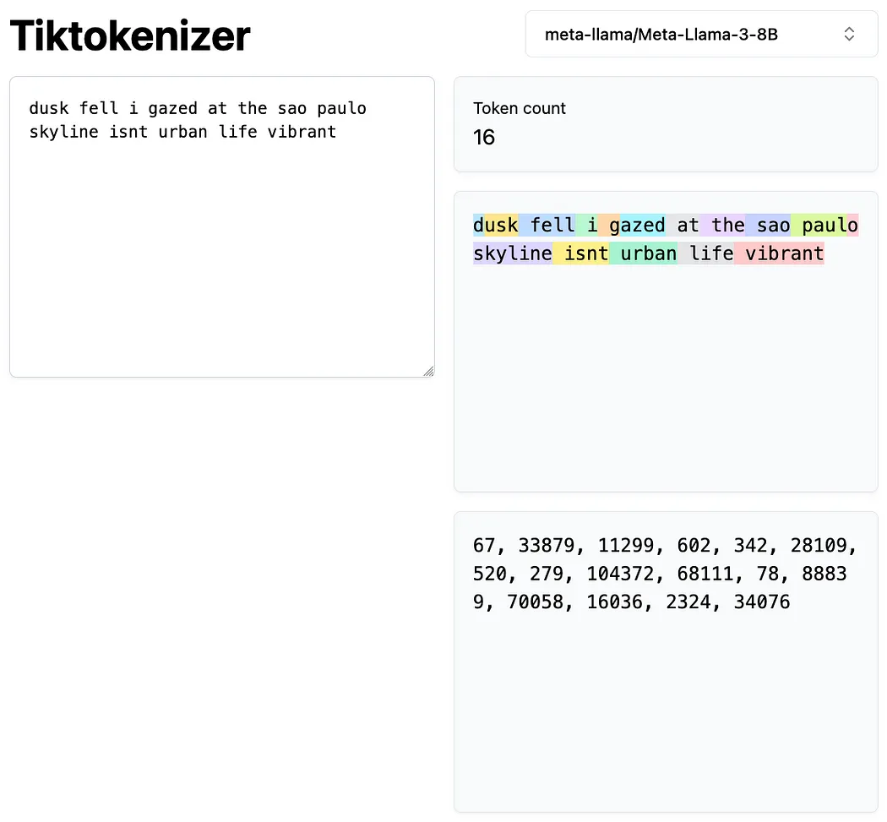
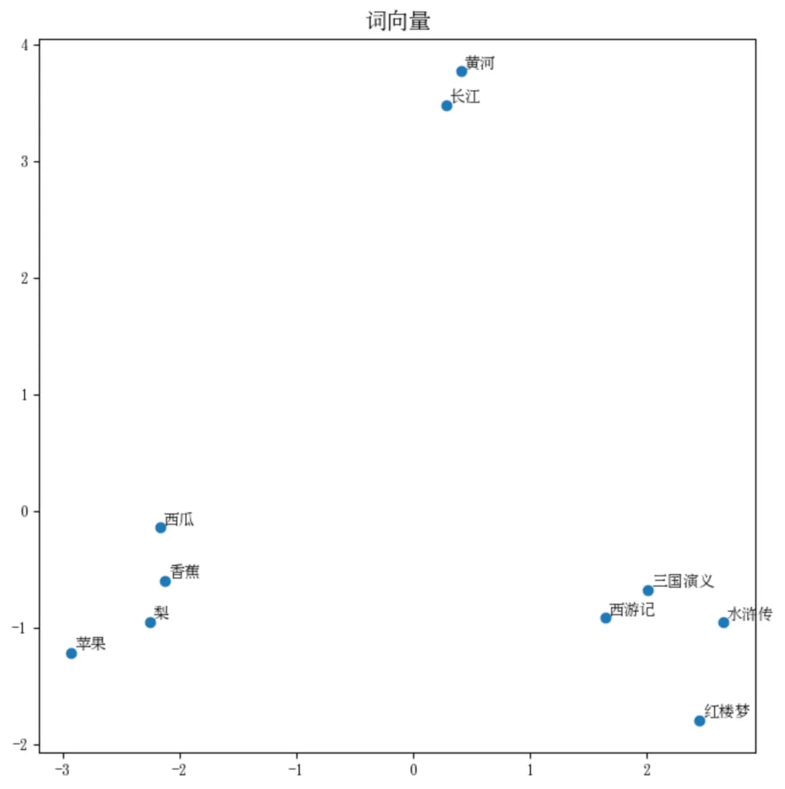

# 嵌入向量与位置信息

## 1. 概述
在自然语言处理（NLP）中，嵌入向量（Embedding）和位置信息（Positional Encoding）是Transformer模型理解文本的关键要素。
它们共同构成了模型处理文本的基础输入。

```
文字也能做运算？当然不行，但是把文字转换成数字之后，就可以用来计算了。而这个过程，叫做 “向量嵌入”。
```

## 2. Tokenization（分词）
- **概念**：将文本转化为数字形式的过程
- **过程**：
  1. 建立词典（Vocabulary）
  2. 将文字与数字进行一一对应
  3. 将文本序列转换为数字序列



## 3. 向量化
- 每个单词被映射为一个512维的向量 (同一个词在不同语境有不同意思)
- 通过神经网络学习每个单词的多维度表示
- 优点：能够捕捉单词的语义信息和语法特征


```
西游记中与'孙悟空'最相关的4个词分别是：
悟空， 余弦相似度为：0.86
唐僧， 余弦相似度为：0.61
美猴王， 余弦相似度为：0.81
猪八戒， 余弦相似度为：0.60
```




## 4. 位置信息的重要性
- 为什么需要位置信息：
  - 自然语言具有顺序性
  - 单词的位置影响语义理解
  - 例如："猫追老鼠" vs "老鼠追猫"
  
- 位置编码方式：
  - 使用正弦和余弦函数生成位置向量
  - 确保模型能够识别单词的绝对位置和相对位置

## 5. 嵌入向量与位置信息的结合
- 将嵌入向量与位置信息向量相加
- 形成最终的输入矩阵
- 优点：
  - 保留单词的语义信息
  - 添加位置信息
  - 帮助模型理解词序和上下文关系

## 6. 总结
嵌入向量和位置信息的结合为Transformer模型提供了：
- 丰富的语义表示
- 精确的位置信息
- 强大的上下文理解能力
  