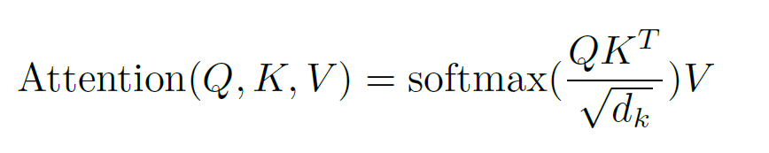

# 注意力机制与输出预测

## 1. 注意力机制的核心作用

在Transformer模型中，注意力机制(Attention)扮演着至关重要的角色。其核心：

已经嵌入向量（Embedding）完成的句子 通过自注意力机制计算每个单词与其他单词的相似度


## 2. 注意力机制的工作原理

注意力机制通过以下步骤实现信息交互：

- 计算查询向量（Query）、键向量（Key）和值向量（Value）
- 使用点积计算注意力分数
- 通过softmax函数将分数转化为概率分布
- 加权求和得到最终的注意力输出




```python
import torch
import torch.nn.functional as F

def attention(query, key, value, mask=None):
    """
    实现注意力机制
    :param query: 查询向量 [batch_size, seq_len, d_k]
    :param key: 键向量 [batch_size, seq_len, d_k]
    :param value: 值向量 [batch_size, seq_len, d_v]
    :param mask: 可选掩码 [batch_size, seq_len, seq_len]
    :return: 注意力输出和注意力权重

    
   - 在实际的Transformer模型中，Q、K、V通常**不是**相同的初始值
   - 它们是通过不同的线性变换从同一个输入向量得到的：
     Q = W_q * X
     K = W_k * X 
     V = W_v * X
   - 其中W_q、W_k、W_v是不同的可学习参数矩阵
    """
    d_k = query.size(-1)
    
    # 1. 计算注意力分数 `matmul`矩阵乘法函数。用于计算两个张量的矩阵乘积
    scores = torch.matmul(query, key.transpose(-2, -1)) / torch.sqrt(
        torch.tensor(d_k, dtype=query.dtype)
    )
    
    # 2. 应用掩码（如果有）
    if mask is not None:
        scores = scores.masked_fill(mask == 0, -1e9)
    
    # 3. 通过softmax得到注意力权重
    p_attn = F.softmax(scores, dim=-1)
    
    # 4. 加权求和得到输出
    return torch.matmul(p_attn, value), p_attn

# 示例用法
batch_size = 2
seq_len = 3
d_k = 4
d_v = 5

query = torch.randn(batch_size, seq_len, d_k)
key = torch.randn(batch_size, seq_len, d_k)
value = torch.randn(batch_size, seq_len, d_v)

output, attention_weights = attention(query, key, value)
print("输出形状:", output.shape)
print("注意力权重形状:", attention_weights.shape)
```
```
输出形状: torch.Size([2, 3, 5])
注意力权重形状: torch.Size([2, 3, 3])
```

## 3. 输出预测机制

在语言模型的输出预测中，主要包含以下关键步骤：

1. **相似度计算**：通过余弦相似度计算两个向量的相似度
2. **训练机制**：使用teacher forcing方法，使得机器在预测下一个字时不能知道下一个字的存在
3. **概率分布**：通过softmax函数生成下一个token的概率分布

## 4. 在LLM中的应用

在大型语言模型（LLM）中，注意力机制与输出预测的结合实现了以下功能：

- **输出形状**：模型输出形状为(batch_size, sequence_length, vocab_size)
- **Layer Normalization**：稳定训练过程，加速收敛
- **残差连接**：防止梯度消失，促进深层网络训练
- **Feed Forward网络**：增加模型表达能力
- **线性变换**：将高维表示映射到词汇表空间
- **预测机制**：通过与词汇表的矩阵相乘，模型预测下一个最可能出现的单词

## 5. 关键技术要点

1. **自注意力机制**：允许模型关注输入序列的不同部分
2. **多头注意力**：并行计算多个注意力头，捕获不同子空间的信息
3. **位置编码**：为模型提供序列位置信息
4. **掩码机制**：防止未来信息泄露，确保自回归预测的有效性