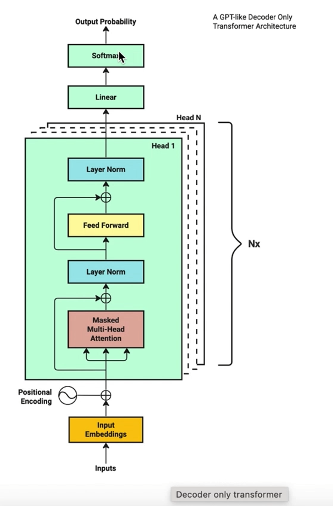

# 从0手写大语言模型-上

## 1 目标

使用 pytorch-lighting 训练 Decoder-Only 的模型



### 1.1 训练过程
1. **数据预处理**：将原始文本数据转换为模型可以理解的数字表示。
2. **模型初始化**：初始化模型的参数，包括词嵌入、位置编码、多头注意力机制、前馈神经网络等。
3. **前向传播**：将输入数据通过模型，计算输出。模型输出每个位置的 token 的概率分布
4. **损失计算**：使用交叉熵损失函数计算模型输出与目标序列之间的损失。
5. **反向传播**：通过梯度下降法更新模型参数。
6. **迭代训练**：重复上述步骤，直到模型收敛。

## 2. 本章节涉及

### 2.1 Tokenization

Tokenization是将文本分割成单词或子词（subword）的过程。每个单词或子词都会被映射到一个唯一的整数ID，从而将文本转换为数字序列。

```python

```

### 2.2 Embedding

Embedding是将Tokenization后的整数ID映射为连续向量空间中的稠密向量的过程。这些向量通常具有固定的维度，并且能够捕捉单词或子词之间的语义关系。通过Embedding，模型可以将离散的符号（如单词）转换为连续的数值表示

```python

```

### 2.3 Position Encoding

Position Encoding（位置编码）是为了在Transformer模型中引入序列的位置信息。由于Transformer模型本身不具备处理序列顺序的能力，Position Encoding通过为每个位置生成一个独特的向量，并将其添加到对应的Embedding向量中，从而使模型能够感知输入序列中各个元素的位置关系。

```python

```