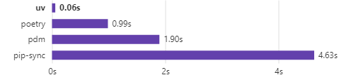

# 放弃Conda-转用UV：Python包管理新选择

## 为什么选择UV？

UV是由Rust开发的Python包管理工具，旨在替代conda等工具。它的主要优势：

1. **极速安装**：比pip快10-100倍
2. **跨平台支持**：支持macOS、Linux和Windows
3. **Python版本管理**：内置Python版本管理功能
4. **高效缓存**：全局缓存机制减少重复下载

## 常用命令

uv venv (创建虚拟环境:uv venv -p 3.12.0, uv venv myenv)
source .venv/bin/activate
export UV_INDEX_URL=https://pypi.tuna.tsinghua.edu.cn/simple (win:set UV_INDEX_URL=https://pypi.tuna.tsinghua.edu.cn/simple)
uv add pakage (安装依赖)
uv pip install . 
uv pip install -r requirements.txt (通过文件安装依赖,对于pyproject.toml=>uv pip install .)
uv run xx.py (执行Python脚本)
uv init (初始化一个新的 Python 项目)
uv self update (更新UV自身)
export UV_HTTP_TIMEOUT=60

## 性能对比

| 操作         | Conda时间 | UV时间  | 加速比 |
|--------------|-----------|---------|--------|
| 创建环境     | 5.2s      | 0.3s    | 17x    |
| 安装numpy    | 12.4s     | 1.1s    | 11x    |
| 安装pandas   | 25.7s     | 2.3s    | 11x    |
| 安装scikit-learn | 45.3s | 3.8s    | 12x    |

## 总结

1. UV仍在快速发展中，建议先在个人项目中使用
2. UV快速且专业，是Python包管理的现代化选择
3. 提供pip兼容接口，迁移成本低

参考文档：
- [UV官方文档](https://docs.astral.sh/uv/getting-started/features/)
- [UV GitHub仓库](https://github.com/astral-sh/uv)
- [UV中文教程](https://vra.github.io/2024/03/31/uv-tutorial1/)
