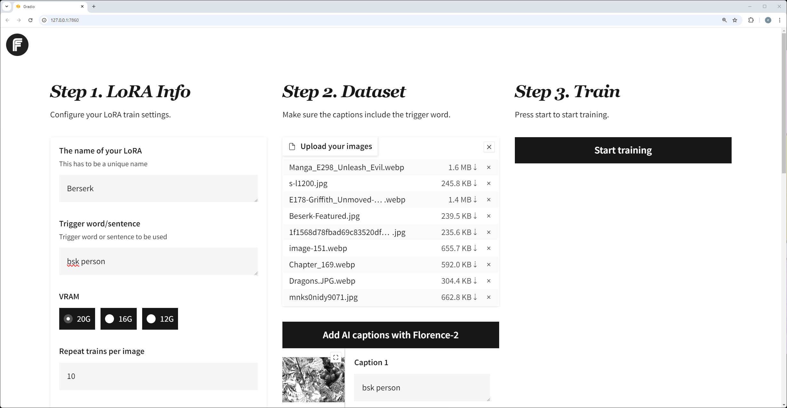
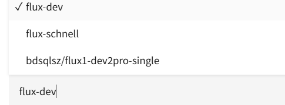

## Fluxgym - LoRA微调框架评测

### 框架特点

| 特性 | Fluxgym | 其他框架 |
|------|---------|----------|
| VRAM需求 | 12GB/16GB/20GB | 通常需要22GB+ |
| 易用性 | 简单Web-UI | 命令行操作 |
| 自动打标 | Florence-2自动打标 | 无 |
| 上传lora->hf | 填入hf-Token即可 | 无 |


#### 评价
```
1. Fluxgym最大的优势在于低显存需求，12GB显存即可运行，大大降低了硬件门槛

2. 基于Kohya脚本开发，功能完整且可扩展，同时提供了简洁的Web UI，降低了使用难度

3. 运行需要自己修改一下代码(模型地址,模型名称,host,端口,安装比较难)

4. 并且训练的时候页面不能刷新,很烦

5. 现阶段最合适的flux的训练框架,其他坑更多...
```



支持微调的模型



### 项目地址:
- [GitHub](https://github.com/cocktailpeanut/fluxgym)
