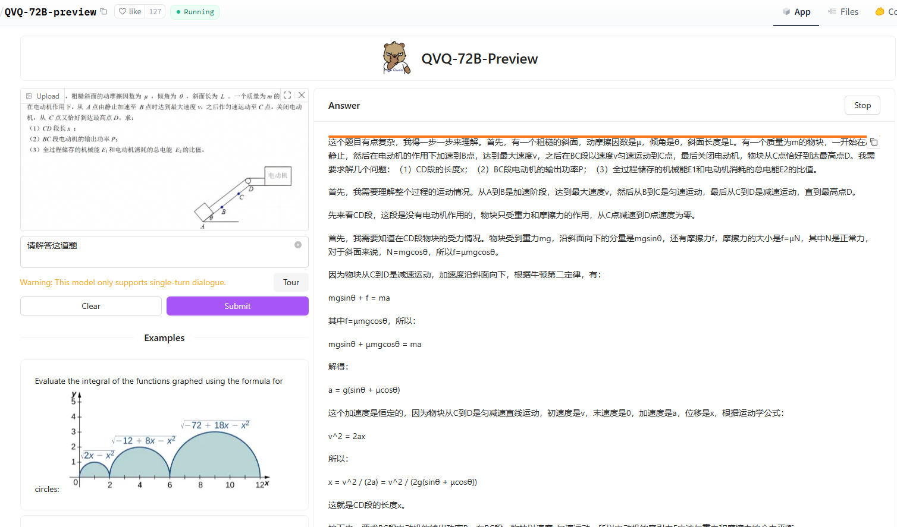
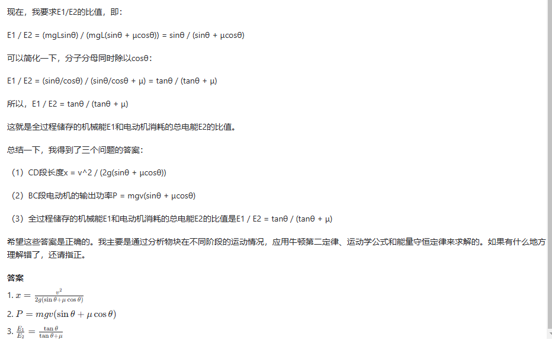

## 千问-QVQ-72B-preview--评测

### 官方宣传的能力

| 模型编号   | QVQ-72B-Preview | o1-2024-12-17 | gpt-4o-2024-05-13 | Claude3.5 Sonnet-20241022 | Qwen2VL-72B |
|---------------------|-----------------|---------------|-------------------|---------------------------|-------------|
| MMMU(val)           | 70.3            | 77.3          | 69.1              | 70.4                      | 64.5        |
| MathVista(mini)     | 71.4            | 71.0          | 63.8              | 65.3                      | 70.5        |
| MathVision(full)    | 35.9            | –             | 30.4              | 35.6                      | 25.9        |
| OlympiadBench       | 20.4            | –             | 25.9              | –                         | 11.2        |

#### 评价
```
1.MMMU得分70.3,作为现阶段开源模型确实很不错了,而且它的OlympiadBench这儿得分尤其引人注意

2.Quickstart里面也给了怎么调用执行的方法,文档还是比较完善的

3.模型文件38个,每个最大4G,还有一些不足4G的,这样看来,模型大小还可以,4卡A100肯定跑的起来了

4.实际测试效果还不错,可以做中学老师了,如下面图片
```





### 模型地址:
- [hf-models](https://huggingface.co/Qwen/QVQ-72B-Preview)

### 测试Space入口:
- [hf-space](https://huggingface.co/spaces/Qwen/QVQ-72B-preview)
