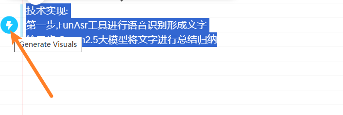
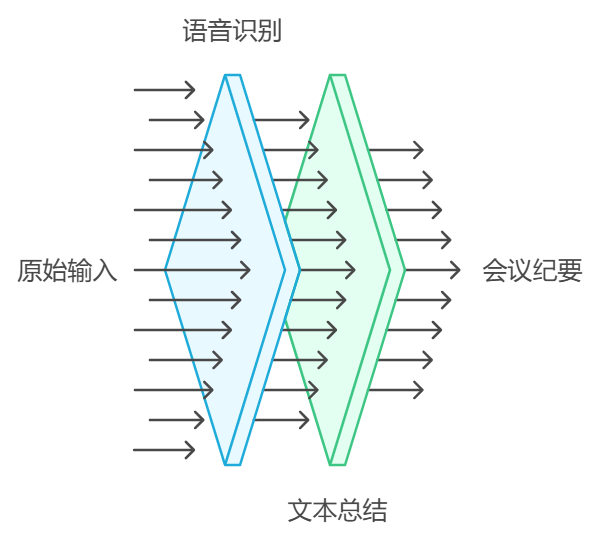

## AI文案配图-Napkin-测评

### 操作方法

1. 进入网站之后输入文字,然后选中文字
2. 点击左侧闪电
> 
3. 选择左侧适合的图片即可
> 

### 例子:

- 由各部门指定专人对知识资料进行收集和审核,确保其准确性、保密性和适用性。在整理过程中,应做好权限分级管控。

> 

- 技术实现:1.语音识别工具进行语音识别转录文字 2.大模型将文字进行总结归纳

> 

### 优势

- 支持中文
- 文字生成可修改
- 支持各种格式,甚至矢量图下载
- 操作简单
- 目前免费

### 地址

需翻墙:https://www.napkin.ai/

### 推荐指数

+ 便利性: ★★★☆
+ 实用性: ★★★★★
