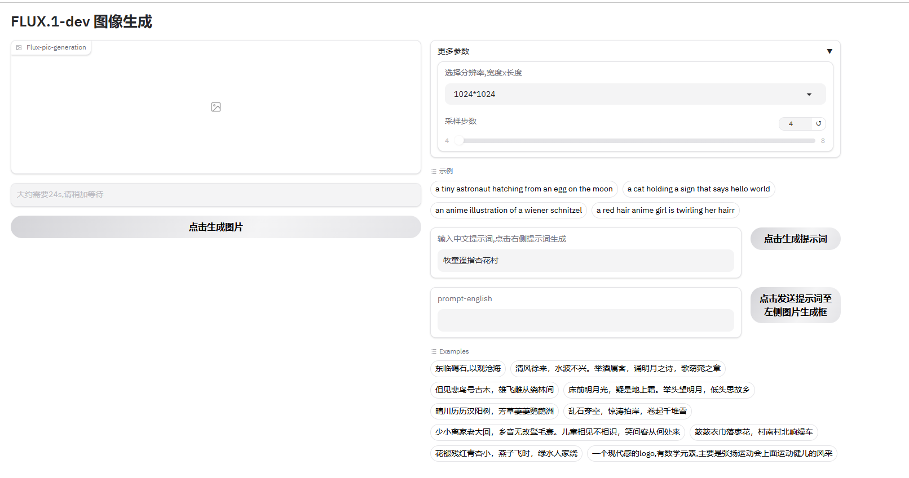
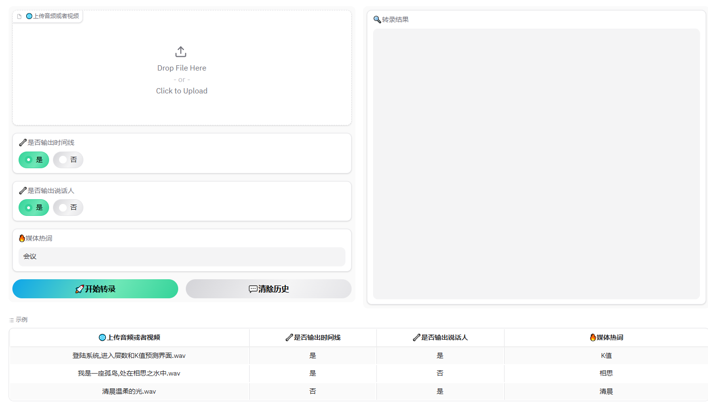
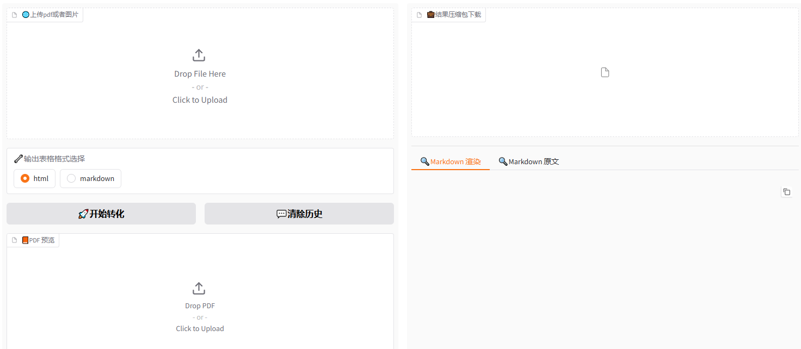

## My_ml_log

my machine learning log

### Type

```
风格迁移, OCR, 文本分类, 实体识别, 语音识别, 图像分类, 目标检测, 自然语言处理, 推荐系统

1_style_transfer
2_OCR
3_text_classification
4_entity_recognition
5_speech_recognition
6_image_classification
7_object_detection
8_NLP
9_recommendation_system
```

### Route

```text
1.先学经典的引人入胜的如cnn/transformer之类的
2.然后接触一些复杂生僻的网络架构
3.补数学知识
4.重学之前的内容
5.全方面细节学习
```

### Structure
```
my_lm_log/
|
├── 0_数学基础/
│   ├── AI-数学-必学/
│   │   ├── 对数.md
│   │   ├── 期望方差.md
│   │   ├── 积分与导数.md
│   │   ├── 线性代数.md
│   │   └── 随机变量与概率分布.md
│   └── AI-数学-选学/
│       ├── 快速傅里叶.md
│       ├── 拉普拉斯变换.md
│       ├── 拉格朗日乘数.md
│       ├── 最大似然估计.md
│       ├── 最小二乘法.md
│       ├── 条件概率.md
│       ├── 牛顿法.md
│       └── 蒙特卡洛方法.md
├── 1_监督学习/
│   ├── 感知机.md
│   ├── 决策树/
│   │   ├── C4.5.md
│   │   ├── CART.md
│   │   └── ID3.md
│   ├── 线性模型/
│   │   ├── 线性回归.md
│   │   └── 逻辑回归.md
│   ├── 集成学习/
│   │   ├── 梯度提升法.md
│   │   ├── 自适应提升法.md
│   │   └── 随机森林.md
│   └── 非参数模型/
│       ├── SVM.md
│       └── k-近邻.md
├── 2_概率模型学习/
│   ├── 最大似然参数学习-离散模型.md
│   ├── 朴素贝叶斯模型.md
│   ├── 隐马尔可夫模型.md
│   └── 马尔可夫模型.md
├── 3_深度学习/
│   ├── 前馈网络/
│   │   └── 前馈神经网络.md
│   ├── 卷积网络/
│   │   ├── CNN.md
│   │   ├── Unet++.md
│   │   ├── Unet.md
│   │   └── 残差网络.md
│   ├── 基础概念/
│   │   ├── 优化器.md
│   │   ├── 初始化方法.md
│   │   ├── 损失函数.md
│   │   ├── 梯度下降.md
│   │   ├── 正则化.md
│   │   └── 激活函数.md
│   ├── 循环神经网络/
│   │   ├── GRU.md
│   │   ├── LSTM.md
│   │   └── RNN.md
│   ├── 无监督学习/
│   │   ├── AE.md
│   │   ├── DDPM.md
│   │   ├── GAN.md
│   │   ├── PCA.md
│   │   ├── PPCA.md
│   │   └── VAE.md
│   └── 泛化/
│       ├── KL散度.md
│       ├── dropout.md
│       ├── 反向传播.md
│       ├── 权重衰减.md
│       └── 梯度下降.md
├── 4_强化学习/
│   ├── DDPG.md
│   ├── RLHF.md
│   ├── 策略梯度.md
│   ├── 重要性采样.md
│   ├── 基础概念/
│   │   ├── 值函数.md
│   │   ├── 奖励.md
│   │   ├── 环境.md
│   │   └── 策略.md
│   └── 深度强化学习/
│       ├── A3C.md
│       ├── DQN.md
│       └── PPO.md
└── 5_NLP/
    ├── T5/
    └── 微调/
        └── Prompt_Tuning.md
```

### Env

```shell
# create
conda create -n ml python=3.10 -y
conda activate ml
python -m venv env
pip install -r requirements.txt
# win
Set-ExecutionPolicy Bypass -Scope Process -Force
.venv\Scripts\activate
# linux
source env/bin/activate
# jupyter
jupyter notebook --port=8888 --allow-root --ip='*'
# 端口进程查询关闭
netstat -tlnp|grep 5500
# pytorch 统一
pip3 install torch torchvision torchaudio --index-url https://download.pytorch.org/whl/cu121
# ollama
Environment="OLLAMA_MODELS=/mnt/data/ollama_models"
Environment="OLLAMA_HOST=0.0.0.0"
# 图标
★☆
# uv-powershell
$env:Path = "C:\Users\lawrence\.local\bin;$env:Path"
uv venv -p 3.12.0  (指定环境保存目录 uv venv /path/to/venv)
uv pip install flask
export UV_INDEX_URL=https://pypi.tuna.tsinghua.edu.cn/simple (setx UV_INDEX_URL "https://pypi.tuna.tsinghua.edu.cn/simple")
```

### Others

```text
author wechat account:sisconsavior

moffee make .\0_数学基础\AI-数学-必学\对数.md -o output_html/
moffee live .\0_数学基础\AI-数学-必学\对数.md
```

| 音频格式转化             | 声音克隆                    | 声音转录文本                       |
|----------------------|-----------------------------|--------------------------------|
| z_utils/audio_trans.py | test/litserve/api/fish_speech1.4_server.py | test/litserve/api/whisper_large_v3_turbo_server.py |

### Some-UI





### Reference

- [概率论与数理统计-浙江大学-第五版](buy-book-oneself)
- [人工智能：现代方法（第4版.pdf）](pdf-no-links)
- [深度学习500问](https://github.com/aceliuchanghong/DeepLearning-500-questions)
- [深度学习入门：基于Python的理论与实现-鱼书](z_using_files/paper/《深度学习入门：基于Python的理论与实现》高清中文版-鱼书.pdf)
- [minimind训练教程](https://github.com/aceliuchanghong/minimind/)
- [周弈帆AI基础博客](https://zhouyifan.net/archives/)
- [Machine Learning From Scratch Youtube](https://www.youtube.com/watch?v=p1hGz0w_OCo&list=PLFJCJMjAqfRLtPS5TOdrr8c3Gv6M1djmi)
- [别人的从基础到入门渐进文章](https://github.com/aceliuchanghong/others-AI-Articles)
- [别人的教学视频-很全面-多学习](https://www.youtube.com/watch?v=2dH_qjc9mFg&list=PLKnIA16_RmvYuZauWaPlRTC54KxSNLtNn)
- [kaggle这么好用的网站也不能忘了](https://www.kaggle.com/datasets/salader/dogs-vs-cats)
- [huggingface-Transformers教程](https://huggingface.co/docs/transformers/index)
- [smol-course现代AI教程](https://github.com/aceliuchanghong/smol-course)
- [书生训练营-看着还不错](https://github.com/InternLM/Tutorial)
- [tiny-llm-zh-教程](https://github.com/aceliuchanghong/tiny-llm-zh)
- 